# Project CYCLOPS

**Bay of Bengal Cyclone Impact & Infrastructure Vulnerability Forecaster**

**Build with AI: Code for Communities (2nd edition) · Track 5 · Team SPECODERS**

Two days before a cyclone makes landfall, this system says **which named
substation, road, hospital and shelter is likely to fail**, how likely, and
why. It then drafts an advisory for each department (power utility, District
Collector, public works, health, municipal body) in English and the district's
language. The advisory is in the Common Alerting Protocol (CAP 1.2) format
that India's national alert system, SACHET, uses. A signed-in officer approves
it before anything can be dispatched, and every decision is kept in BigQuery.

It is built on **Gemini 3.7 Flash**, **Google Earth Engine**, **Google
DeepMind's WeatherNext** cyclone ensembles, **BigQuery** and **Firebase
Authentication**, and is packaged for **Cloud Run**.

> **Decision support only.** The India Meteorological Department (IMD) is the
> statutory cyclone warning authority. Every alert here is marked
> `<status>Exercise</status>`, and nothing is sent to the public.

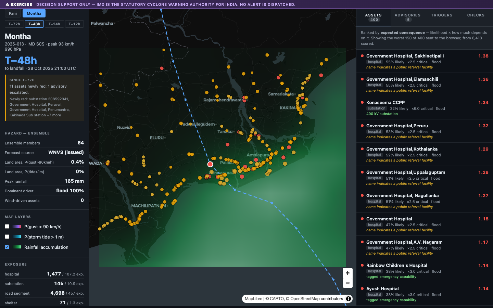

*The console replaying Cyclone Montha (October 2025) 48 hours before landfall.
Every dot is a real asset from OpenStreetMap; the list on the right ranks them
by what is at stake.*

---

## Contents

1. [The problem](#1-the-problem)
2. [What it does](#2-what-it-does)
3. [Try it in five minutes](#3-try-it-in-five-minutes)
4. [Full setup: Earth Engine, Gemini, BigQuery, Firebase](#4-full-setup-earth-engine-gemini-bigquery-firebase)
5. [Using the console](#5-using-the-console)
6. [How it works](#6-how-it-works)
7. [Google technologies used](#7-google-technologies-used)
8. [Results, misses included](#8-results-misses-included)
9. [Accountability: sign-in and a permanent record](#9-accountability-sign-in-and-a-permanent-record)
10. [Phase 2: the ground sensor network](#10-phase-2-the-ground-sensor-network)
11. [Research behind the design](#11-research-behind-the-design)
12. [Guardrails](#12-guardrails)
13. [Testing and quality](#13-testing-and-quality)
14. [Configuration reference](#14-configuration-reference)
15. [Security and secrets](#15-security-and-secrets)
16. [What is not built yet](#16-what-is-not-built-yet)
17. [Roadmap](#17-roadmap)
18. [Repository layout](#18-repository-layout)
19. [Data sources and attribution](#19-data-sources-and-attribution)

---

## 1. The problem

Evacuation in the Bay of Bengal now works. Deaths in Odisha fell from 9,887
in the 1999 Super Cyclone to 64 in Cyclone Fani (2019), and in Bangladesh
from about 138,000 in 1991 to 19 in Bulbul (2019). **Infrastructure still
fails.** Fani brought down about 156,000 utility poles, left about 3.5
million households without power, and rural Odisha waited about two months
for electricity to come back.

And the storm's category no longer says how bad it will be. The two costliest
storms of the 2025 North Indian Ocean season, **Senyar (US$19.8 bn)** and
**Ditwah (US$4.1 bn, about 4% of Sri Lanka's GDP)**, never passed 85 km/h.
Rain and landslides did the damage. A model that scores wind alone rates both
as minor.

So the question a district needs answered is no longer *"will people die?"*
but **"which asset fails, and what should each department do 48 hours
out?"** Today's warnings stop at district colours. IMD's impact-based
warnings name districts and hazard levels; INCOIS forecasts the surge but not
what it breaks; SACHET delivers alerts but does not write them. This project
fills the step between them: each department's own assets, by name, at the
lead time it needs.

Sources for every figure are in [section 11](#11-research-behind-the-design).

---

## 2. What it does

| | |
|---|---|
| **Ranks every asset** | 6,418 real assets on the Andhra coast (3,172 in Odisha) scored for failure probability from wind and flood, weighted by what depends on them |
| **Treats rain as a damage pathway** | Wind, a storm-surge screen and rain ponding each drive failure, so a weak, wet storm is not scored as harmless |
| **Shows its uncertainty** | Every number comes from a 64-member forecast ensemble, and every advisory quotes the 10th–90th percentile spread |
| **Writes department advisories** | CAP 1.2 alerts, one per department, naming the assets and the action, in English and Telugu; Odisha storms request Odia the same way |
| **Keeps a human in charge** | Nothing is dispatched until a signed-in officer approves; every approval, withdrawal and dispatch is kept in BigQuery |
| **Checks itself** | After landfall each forecast is scored against satellites (GPM rain, Sentinel-1 flood radar, VIIRS night lights), and the misses are published |

| | |
|---|---|
| 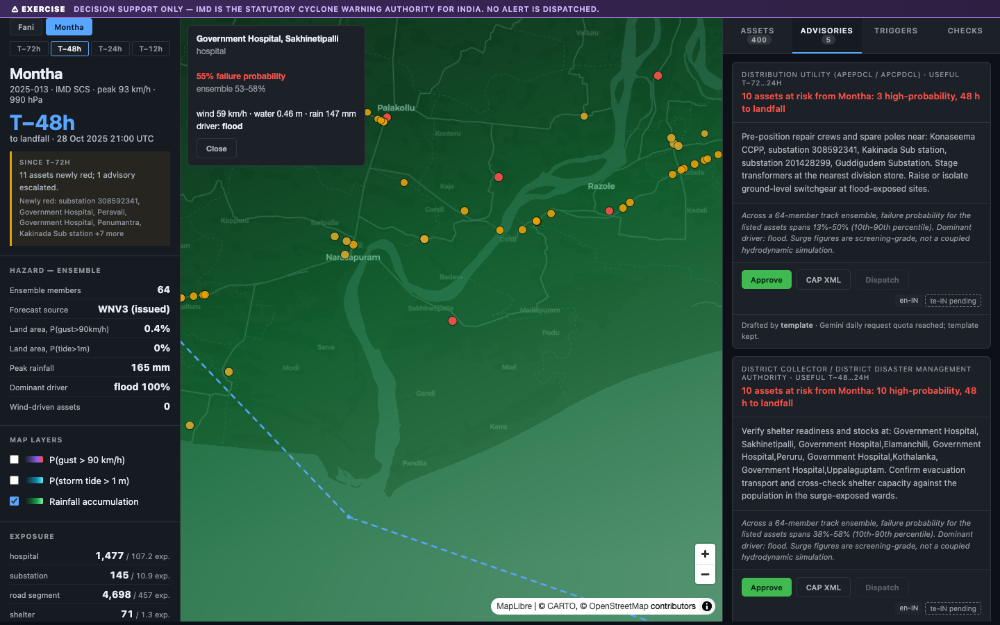 | 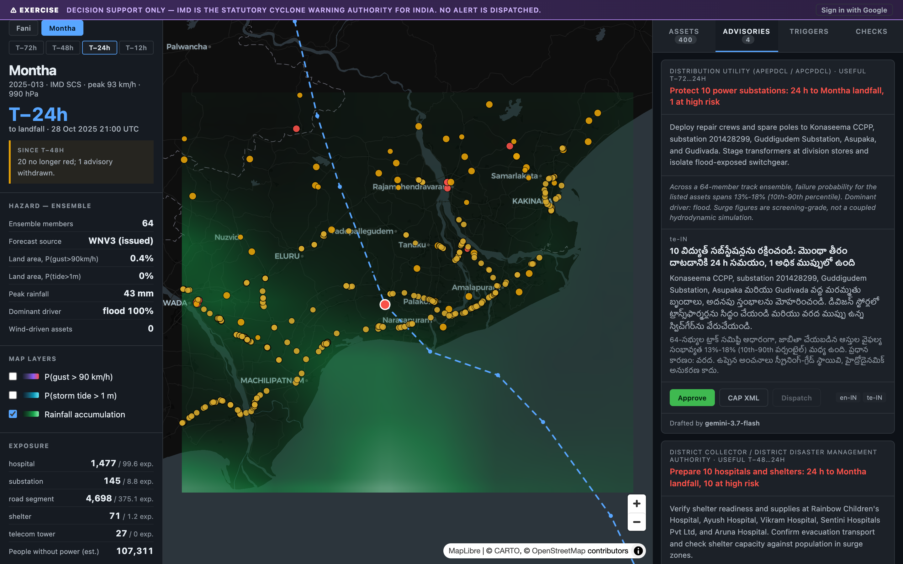 |
| Advisories for each department, awaiting an officer | The power utility's advisory in English and Telugu, drafted by Gemini 3.7 Flash |
| 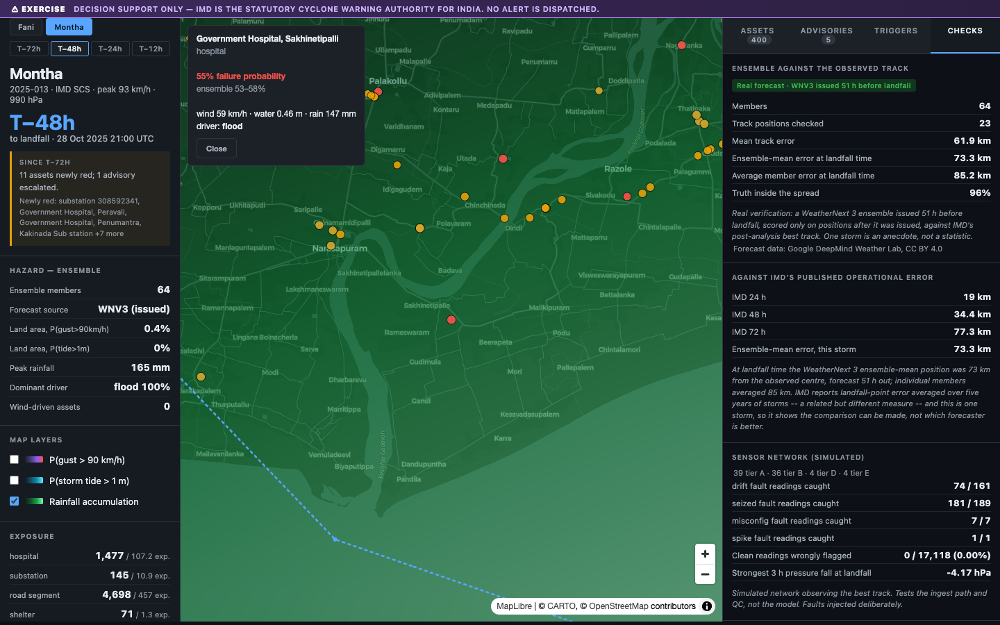 | 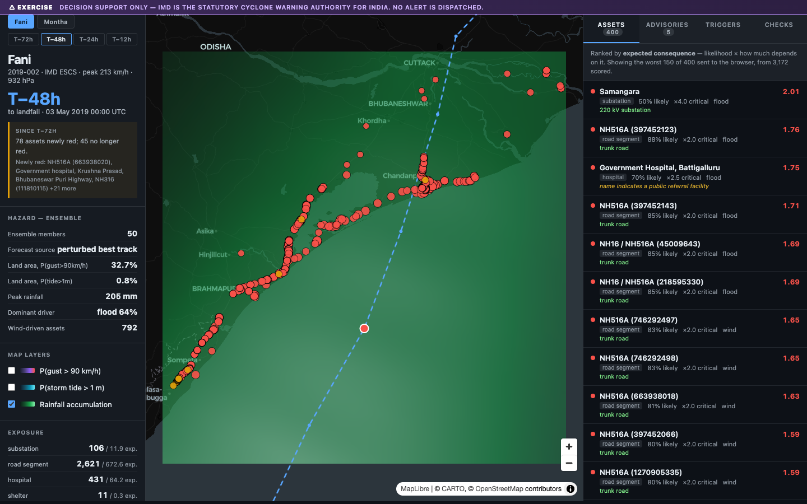 |
| The Checks tab: the forecast scored against observations | Cyclone Fani (2019), a wind-driven storm, in the same console |
| 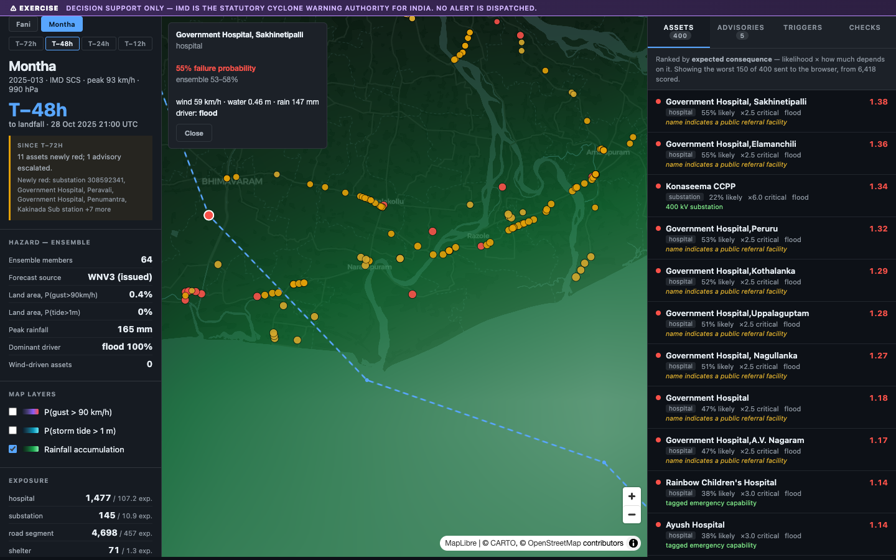 | 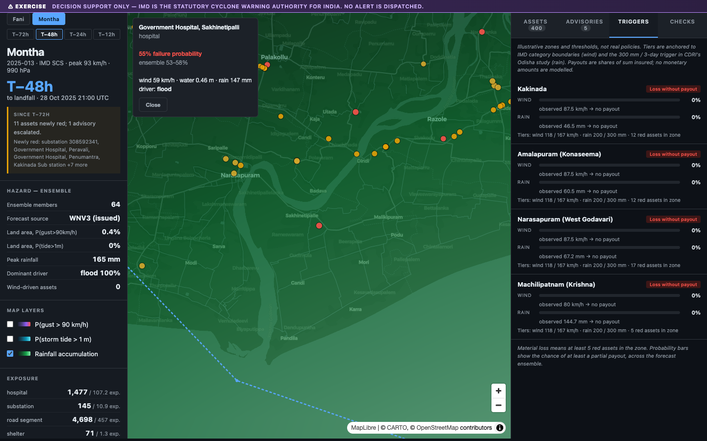 |
| One asset: probability, spread, driver and why it ranks where it does | Parametric insurance triggers and basis risk, for disaster funds |

The console also works at phone width ([`docs/screenshots/08-phone.png`](docs/screenshots/08-phone.png)).

---

## 3. Try it in five minutes

No accounts, keys or network are needed: eight forecast replays (Cyclone
Montha and Cyclone Fani, each at 72, 48, 24 and 12 hours before landfall)
are committed in `data/runs`.

### What you need

| Requirement | Version | Needed for |
|---|---|---|
| macOS or Linux (on Windows, use [WSL 2](https://learn.microsoft.com/windows/wsl/install)) | | The scripts are Bash |
| [Python](https://www.python.org/downloads/) | **3.12 or newer** | Everything |
| [Git](https://git-scm.com/downloads) | any | Cloning |
| [Node.js](https://nodejs.org/) | 22 or newer | Only the console's JavaScript tests |
| [Google Chrome](https://www.google.com/chrome/) | any recent | Only the browser test and screenshots |

### Steps

```bash
# 1. Get the code
git clone https://github.com/yashm-0804/project-cyclops.git
cd project-cyclops

# 2. Make a virtual environment and install the exact, hash-locked dependencies
python3 -m venv .venv
.venv/bin/pip install --require-hashes -r requirements-dev.lock

# 3. Start the console
./run.sh
```

Open **http://localhost:8077**. The API's own documentation is at
http://localhost:8077/docs.

To run every check that CI runs (lint, strict types, tests, security scans):

```bash
./check.sh
```

**If something goes wrong**

- *`No venv`*: step 2 did not finish. Re-run it and read the first error.
- *SSL or certificate errors on macOS*: python.org builds ship without root
  certificates. `run.sh` and `check.sh` fix this for themselves; for your own
  commands run `export SSL_CERT_FILE=$(.venv/bin/python -m certifi)` first.
- *Port 8077 in use*: `PORT=8090 ./run.sh`.
- *A different storm or lead time first*: `STORM=FANI LEAD=24 ./run.sh`.

---

## 4. Full setup: Earth Engine, Gemini, BigQuery, Firebase

Everything in this section is **optional**. It is needed only to regenerate
the forecasts from live data, to have Gemini draft and translate, or to turn
on sign-in and the BigQuery record. Each service is used within its free
tier; none needs a billing account except the Cloud Run deployment.

All keys and project ids go into a local `.env` file, which is git-ignored:

```bash
cp .env.example .env     # then fill in only the lines you need
```

### 4.1 Google Earth Engine (terrain and satellite checks)

Earth Engine supplies the Copernicus 30 m terrain and the after-landfall
satellite checks (GPM rain, Sentinel-1 flood radar, VIIRS night lights).
Without it the pipeline falls back to the same terrain from AWS, and skips
the satellite checks.

1. Create a Google Cloud project, or choose one:
   https://console.cloud.google.com/projectcreate
2. Register the project for Earth Engine, choosing **non-commercial use**:
   https://code.earthengine.google.com/register. This also enables the Earth
   Engine API on it.
3. Sign in on this machine. A browser window opens; the credentials are
   stored in your home folder, never in the repository:
   ```bash
   .venv/bin/earthengine authenticate
   ```
4. Tell the pipeline which project to use. There is deliberately no default,
   so a run on someone else's machine never uses your project:
   ```bash
   # in .env
   EE_PROJECT=your-project-id
   ```
5. Check it works:
   ```bash
   export SSL_CERT_FILE=$(.venv/bin/python -m certifi)
   .venv/bin/python -c "import envfile, ingest.earthengine as ee; envfile.load(); print('Earth Engine ready:', ee.initialise())"
   ```

### 4.2 Gemini API (drafting and translation)

Gemini 3.7 Flash rewords each advisory and translates it into Telugu or Odia.
Every number in its text is checked against the numbers the code computed
([section 12](#12-guardrails)).

1. Create a key at https://aistudio.google.com/apikey.
2. Add it to `.env`:
   ```bash
   GEMINI_API_KEY=your-key
   ```
3. Optionally, add a second key from **another** Google Cloud project as
   `GEMINI_API_KEY_2`. It is used only when the first key's quota runs out;
   an overloaded model is the same for every key, so that never switches.
4. Without a key, or once every key's daily limit is spent, advisories
   keep their template text and say why. The pipeline makes **one request per
   forecast cycle** and caches it, so a full two-storm replay costs eight
   requests.

### 4.3 Regenerate the forecasts

This downloads the IMD best track, OpenStreetMap assets, terrain, the
WeatherNext ensembles from the Weather Lab archive and the GFS rainfall
forecast, and caches them in `data/cache` (git-ignored). The first run takes
several minutes; later runs take 3 to 4 seconds a cycle.

```bash
.venv/bin/python -m agent.watch --replay MONTHA 2025 --region andhra
.venv/bin/python -m agent.watch --replay FANI 2019 --region odisha
.venv/bin/python -m telemetry.simulate MONTHA 2025 --region andhra   # the simulated sensor network
```

### 4.4 BigQuery (the permanent record of approvals)

Approvals, withdrawals and dispatches go into one BigQuery table. It fits
in BigQuery's free sandbox, with no billing account: writes are free load
jobs, and reads run no query.

1. Sign in with the `cloud-platform` scope. `earthengine authenticate`
   grants it by default; otherwise use `gcloud auth application-default login`.
2. Make the dataset and table:
   ```bash
   .venv/bin/python scripts/bigquery_setup.py your-project-id
   ```
3. Add to `.env`:
   ```bash
   BOB_AUDIT_STORE=bigquery
   BOB_BQ_AUDIT_TABLE=your-project-id.bob_forecaster.audit_events
   ```

In the sandbox every table expires within 60 days; the server moves the
expiry forward whenever it starts or records something. See
[`DEPLOY.md`](DEPLOY.md#approvals-in-bigquery) for limits and measurements.

### 4.5 Firebase Authentication (officers sign in with Google)

Without this, a laptop checkout is open, and a deployment needs a shared
operator code. With it, only listed Google accounts can approve, and each
approval is recorded against the verified address.

1. In the [Firebase console](https://console.firebase.google.com/), add
   Firebase to your Google Cloud project. Enable **Authentication → Sign-in
   method → Google**, and register a **web app**.
2. Copy three values from the web app's `firebaseConfig` into `.env`, and
   list who may act:
   ```bash
   BOB_FIREBASE_PROJECT=your-project-id          # firebaseConfig.projectId
   BOB_FIREBASE_API_KEY=...                      # firebaseConfig.apiKey
   BOB_FIREBASE_APP_ID=...                       # firebaseConfig.appId
   BOB_OPERATORS=officer@example.gov.in,@example.org   # addresses, or whole @domains
   ```
3. Restart `./run.sh`. A **Sign in with Google** button appears in the top
   bar. `localhost` is an authorised domain by default; add your deployment's
   address under **Authentication → Settings → Authorized domains**.

### 4.6 Deploy to Cloud Run

[`DEPLOY.md`](DEPLOY.md) has the full commands: access codes in Secret
Manager, the BigQuery roles for the service account, and
`gcloud run deploy`. The image serves precomputed runs, holds no
credentials, and refuses every write if its access codes are missing.
Deploying needs a billing account on the project.

---

## 5. Using the console

1. **Pick a storm and a lead time** in the top left: Fani or Montha, then
   T−72h to T−12h. The panel shows the ensemble, the hazards and what changed
   since the last cycle.
2. **Assets** ranks every asset by expected consequence. Click one to see
   its failure probability, spread, dominant hazard and why it ranks there.
   The map layers switch between wind, storm tide and rainfall.
3. **Advisories** holds one CAP alert per department, awaiting approval.
   Switch between `en-IN` and `te-IN`, open the **CAP XML**, then
   **Approve**. **Dispatch** is refused until someone approves, and an
   approval covers only the exact text that was approved.
4. **Triggers** shows illustrative parametric insurance zones: the chance of
   each payout before landfall, and basis risk after it.
5. **Checks** scores the forecast against what happened, and says what
   each check could not see.

The banner is always visible: this is an exercise, and IMD is the warning
authority.

---

## 6. How it works

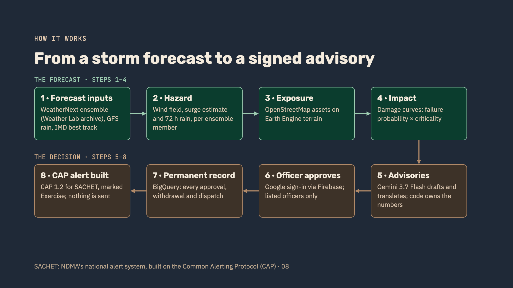

One forecast cycle, end to end, in 3 to 4 seconds on a laptop with a warm
cache ([`docs/BENCHMARK.md`](docs/BENCHMARK.md)):

```
  IMD best track ───────────────────────┐
  WeatherNext 3 ensembles (Weather Lab)─┤
  GFS rainfall forecast ────────────────┼──► hazard ──► impact ──► advisory ──► Gemini 3.7 Flash
  Copernicus DEM (Earth Engine) ────────┤    wind        fragility    CAP 1.2      rewords, translates;
  Ground sensor network (simulated) ────┘    surge       rollup       + human      every number checked
                                             rainfall    triggers       approval
  After landfall: GPM IMERG, Sentinel-1, VIIRS (Earth Engine) ──► verify: scored, misses shown
```

### How one asset gets its failure probability

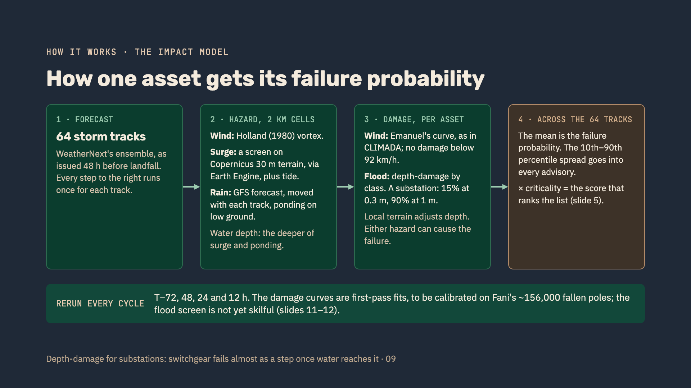

1. **Forecast.** The 64 WeatherNext 3 ensemble members, as issued before
   landfall. Every later step runs once per member.
2. **Hazard, on a grid of about 2 km cells.**
   - *Wind*: the Holland (1980) vortex, with asymmetry from the storm's
     motion and decay over land.
   - *Surge*: a parametric screen on Copernicus 30 m terrain, fetched through
     Earth Engine, with the sea-connected low ground only, plus tide.
   - *Rain*: the GFS forecast, moved with each member's track; ponding on
     low ground.
   - *Water depth* at an asset is the deeper of surge and ponding.
3. **Damage, per asset.** Wind through Emanuel's curve, as used in CLIMADA
   (no damage below 92 km/h); flood through a depth-damage curve for each
   class. For example, a substation is 15% likely to fail at 0.3 m of water
   and 90% at 1 m. The terrain under the asset adjusts the depth. Either
   hazard can cause the failure: `p = 1 − (1 − p_wind)(1 − p_flood)`.
4. **Across the 64 members.** The mean is the failure probability; the
   10th–90th percentile spread goes into every advisory.
5. **Criticality.** The score that ranks the list is *probability ×
   criticality*. Criticality comes from real OpenStreetMap attributes:
   transmission voltage for substations (400 kV = ×6.0, 220 kV = ×4.0,
   132 kV = ×2.5), and a government or referral hospital by name (×2.5).
   A score of 1.0 means one typical asset's worth expected lost. **Red**
   (1.0 or more) means act this cycle; orange (0.6 or more) means prepare;
   yellow (0.25 or more) means monitor.

`docs/ARCHITECTURE.md` follows one forecast cycle through the code, then an
approval through the console and API.

### Modules

Every module below exists and has tests. Paths that need Earth Engine or
Gemini are tested through stand-ins (recorded arrays, fake replies).

| Module | Does |
|---|---|
| `ingest/tracks.py` | IMD best track → `TrackPoint` list, with Rmax and forward motion derived |
| `ingest/gfs.py` | GFS 72-hour rainfall forecast, fetched by byte range from NOAA's open archive |
| `ingest/weatherlab.py` | Real WeatherNext 3 ensemble forecasts from the Weather Lab archive (CC BY 4.0) |
| `ingest/ensemble.py` | Fallback: perturbed tracks, spread scaled to IMD's published landfall error |
| `ingest/earthengine.py` | Earth Engine sign-in, with plain reasons when it fails |
| `hazard/holland.py` | Holland (1980) wind swath, translation asymmetry, overland decay |
| `hazard/rainfall.py` | R-CLIPER accumulation and rain-ponding depth |
| `hazard/surge_screen.py` | Parametric storm-tide screen with sea-connectivity masking |
| `hazard/terrain.py` | Copernicus 30 m elevation via Earth Engine or AWS; coastline from terrain |
| `exposure/osm.py` | Overpass fetch and classification of real infrastructure |
| `impact/fragility.py` | Emanuel wind sigmoid and flood depth–damage curves |
| `impact/consequence.py` | Criticality weighting from real OSM attributes |
| `impact/rollup.py` | Per-asset scoring across the ensemble, sub-grid elevation, severity bands |
| `impact/triggers.py` | Parametric trigger probabilities and post-event basis risk (illustrative zones) |
| `advisory/cap.py` | Department routing and CAP 1.2 XML |
| `advisory/gemini.py` | Gemini drafting and translation behind the number guardrail |
| `advisory/numbers.py` | How model text is read for numbers, units, numerals, money and number words |
| `agent/watch.py` | Re-runs every forecast cycle and reports what changed |
| `verify/metrics.py` | Contingency scores, Brier score, reliability bins |
| `verify/ensemble_skill.py` | The ensemble against the observed best track |
| `verify/satellite.py` | GPM IMERG, VIIRS Black Marble and Sentinel-1 on the hazard grid, through Earth Engine |
| `verify/observed_skill.py` | Rain, flood and outage forecasts scored against those observations |
| `telemetry/schema.py` | Sensor node tiers and the wire schema |
| `telemetry/qc.py` | Quality control: ranges, spikes, flatlines, neighbour check, drift |
| `telemetry/ingest.py` | Validate, check and store observations |
| `telemetry/simulate.py` | A simulated tiered network observing a real storm, with injected faults |
| `telemetry/features.py` | 3-hour pressure tendency and rain accumulation from trusted readings |
| `api/main.py` | FastAPI routes: the approval gate, dispatch refusal, health |
| `api/identity.py` | Google sign-in for officers: checks Firebase ID tokens and the officer list |
| `api/bigquery_audit.py` | The append-only audit trail in BigQuery |
| `api/audit.py` | The same trail in SQLite, for a laptop |
| `api/access.py`, `api/guard.py`, `api/ratelimit.py` | Access codes, request checks, security headers, write budgets |
| `web/` | The console: HTML, CSS and JavaScript, with MapLibre and Firebase served locally |
| `pipeline.py` | Orchestration and export |

---

## 7. Google technologies used

| Technology | What it does here | Status |
|---|---|---|
| **Gemini 3.7 Flash** | Rewords each department's advisory and translates it into Telugu or Odia. A guardrail rejects any number it did not receive from the code | In use; one request per forecast cycle on the free tier |
| **Google Earth Engine** | Copernicus 30 m terrain for surge and ponding; after landfall, GPM IMERG rain, Sentinel-1 flood radar (UN-SPIDER's method) and VIIRS Black Marble night lights, all on the model's own grid | In use |
| **WeatherNext 3** (Google DeepMind, through the Weather Lab archive) | The 64-member cyclone track ensembles actually issued before Montha's landfall | In use |
| **BigQuery** | The permanent record of every approval, withdrawal and dispatch, within the free sandbox | Live; tested against the real service |
| **Firebase Authentication** | Officers sign in with Google; only listed accounts can act | Live on the console |
| **Cloud Run** | Container, CI smoke test and deploy commands | Ready; not deployed (needs a billing account) |

---

## 8. Results, misses included

### The thesis, checkable in two clicks

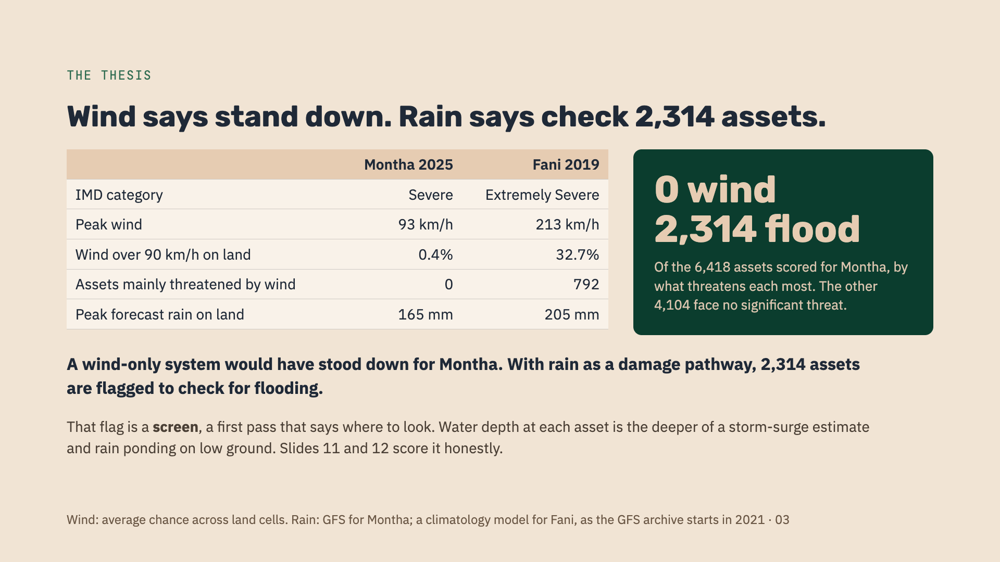

| | Montha 2025 | Fani 2019 |
|---|---|---|
| IMD category | Severe Cyclonic Storm | Extremely Severe |
| Peak wind | 93 km/h | 213 km/h |
| Average chance of wind over 90 km/h on land | **0.4%** | **32.7%** |
| Assets mainly threatened by wind | **0** | **792** |
| Peak forecast rain on land | 165 mm (GFS) | 205 mm (R-CLIPER) |

A wind-only system would have stood down for Montha. With rain as a damage
pathway, **2,314 of Montha's 6,418 assets are flagged for flooding** (the
other 4,104 face no significant threat). That flag is a *screen*: a first
pass that says where to look, not yet a verified forecast. The checks below
show how well it did.

### The storm track: WeatherNext against what happened

Montha, scored only on positions after each forecast was issued, against
IMD's post-analysis best track:

| Issued before landfall | Ensemble-mean error at landfall | IMD's published average error | Truth inside the ensemble's spread |
|---|---|---|---|
| 75 h | 71 km | 77 km (72 h) | 100% |
| 51 h | 73 km | 34 km (48 h) | 96% |
| 27 h | 27 km | 19 km (24 h) | 93% |
| 15 h | 20 km | – | 64% |

The error shrinks as landfall nears. At 75 h it beats IMD's five-year
average; at 51 h and 27 h it trails it; close in, the ensemble is
overconfident. IMD's figure is an average over five years of storms and
this is one storm, so this shows the comparison can be made, not which
forecaster is better.

### Hazards: checked by satellite

Each T−48 h forecast, scored on land cells against observations pulled
through Earth Engine:

| Check | Montha 2025 | Fani 2019 |
|---|---|---|
| Rain forecast used | GFS | R-CLIPER (the GFS archive starts in 2021) |
| Rain total, forecast ÷ observed (1.0 = right) | 0.82 | 1.67 |
| Rain pattern correlation (1.0 = perfect) | 0.32 | 0.73 |
| Flood cells, observed / predicted / both | 208 / 210 / 3 | 64 / 872 / 18 |
| Flood Brier skill against climatology (above 0 is useful) | −0.72 | −11.3 |
| Lit substations that went dark | 0 of 105 | 36 of 43 |
| Outages predicted / happened | 7 / 0 | 3 / 2 |

### Where the flood screen went wrong

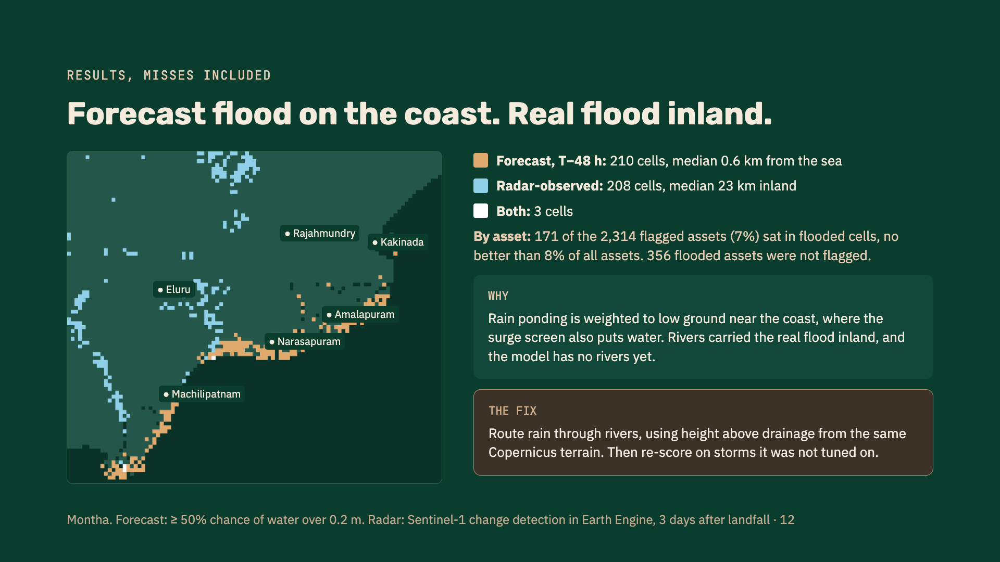

- **The flood screen looked at the coast; the water was inland.** Predicted
  flooding sits a median 0.6 km from the sea; the radar saw it a median
  23 km inland, along rivers. Rain ponding is weighted to low ground near
  the coast, where the surge screen also puts water, and the model has no
  rivers yet.
- **By asset, the flag did no better than chance.** Of the 2,314 assets
  flagged for flooding, 171 (7%) sat in cells the radar saw flooded, against
  8% of all 6,418 assets; 356 assets in flooded cells were not flagged.
  (From the committed T−48 h run and the Sentinel-1 pass 3.1 days after
  landfall.)
- **The radar sees less than there was.** Sentinel-1's pass came 3.1 days
  after Montha's landfall, when much of the water would have drained, and it
  misses water under crops and between buildings.
- **Substation scores miss area-wide outages.** Fani darkened 36 of 43 lit
  substation cells, though the model expected 3 substations to fail. The
  lights most likely went out because lines and poles failed, which the
  substation score does not model. Montha darkened none, so all 7 predicted
  outages were false alarms.
- **Rain is the most usable layer so far.** For Montha, the real GFS forecast
  beat the parametric fallback on bias, correlation and error, though
  correlation 0.32 means the rain was placed only loosely.

**What holds up today:** the track ensemble, the rain totals, the pipeline,
the advisories and the signed record. The flood and outage layers are
screens, so the ranking is only as good as they are. The fix is to route
rain through rivers, using height above drainage from the same Copernicus
terrain, and add poles and lines. Each change must pass a test on storms it
was not tuned on before its output is called a forecast
([`docs/MODEL_SKILL.md`](docs/MODEL_SKILL.md)). **Two storms are an
anecdote, not a validation**; the checks exist so the next storm is scored
the same way, automatically.

**Terrain sensitivity.** The same elevation model fetched two ways, through
Earth Engine and from AWS, differs by a median 0.1–0.3 m, and that alone
moves Fani's T−48 h count of newly red assets from 73 to 78. Single-asset
ranks should be read with that margin.

---

## 9. Accountability: sign-in and a permanent record

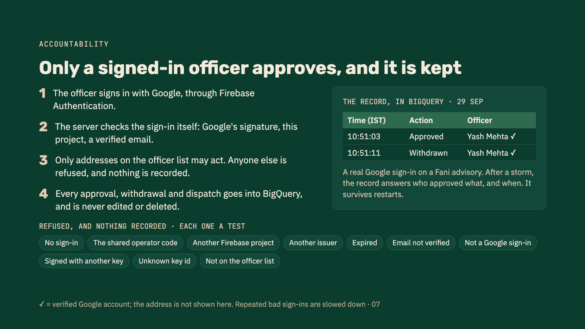

1. The officer signs in with Google, through Firebase Authentication.
2. The server checks the sign-in itself: Google's signature, this project,
   a verified email, not expired.
3. Only addresses on the officer list (`BOB_OPERATORS`) may act. Anyone
   else is refused, and nothing is recorded.
4. Every approval, withdrawal and dispatch is appended to BigQuery, and
   never edited or deleted. An approval covers only the exact advisory text
   that was approved, and a new forecast cycle needs a new approval.

Each of these is refused, with nothing recorded, and each has a test
(`tests/test_identity.py`): no sign-in; the shared operator code in place of
a sign-in; another Firebase project; another issuer; an expired token; an
unverified email; a sign-in that is not Google; a token signed with another
key; an unknown key id; an account not on the officer list. Repeated bad
sign-ins are slowed down.

---

## 10. Phase 2: the ground sensor network

The forecast runs without sensor data today. Phase 2 adds a low-cost ground
network whose readings arrive **before** landfall, so departments are
already positioned when the storm arrives. The software half is built and
tested on a simulated network; the hardware is a proposed design.

| Outside: the node on its pole | Inside: the sealed electronics box |
|---|---|
| 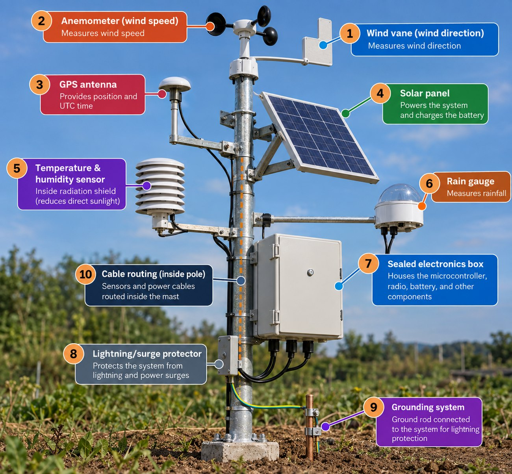 | 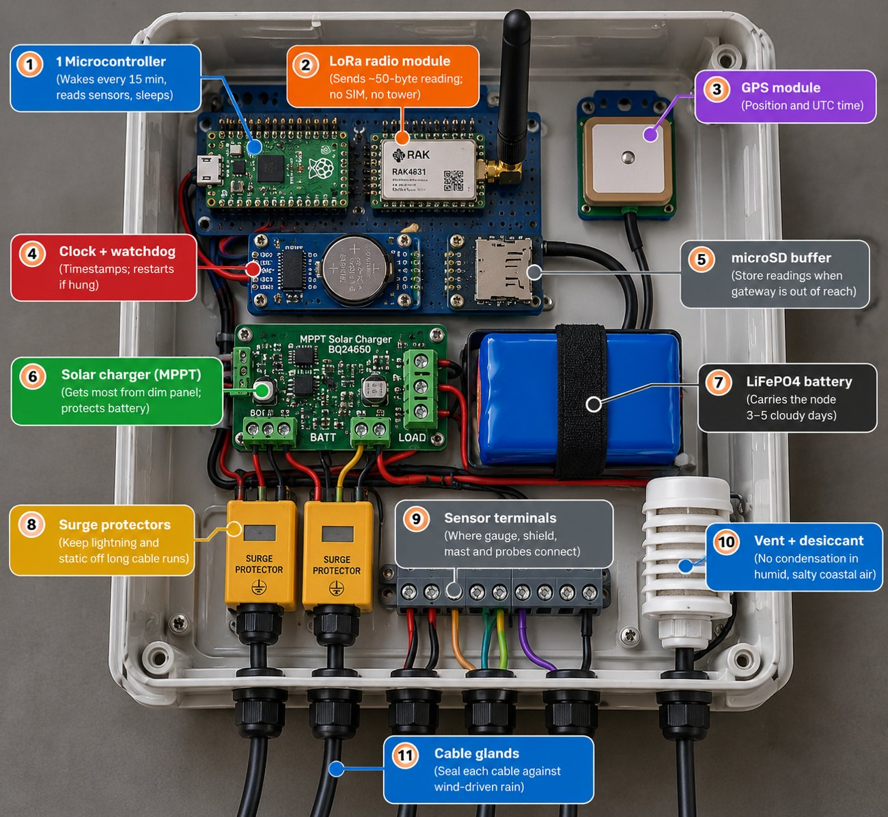 |

*Concept renders, not built hardware. Shown with the wind kit (Tier C).*

The instrument follows the site's role, so the expensive instrument goes only
where it pays:

| Tier | Where | Instruments | Cost | What it is for |
|---|---|---|---|---|
| **A** · Air | Everywhere, ~25 km apart | Pressure, temperature, humidity; LoRa radio; solar | ₹6–8k | 3-hour pressure fall (computed today) |
| **B** · Rain | Flat and urban catchments, ~5 km apart | Tier A + optical rain gauge | ₹15–18k | Local rain totals (computed today), to correct forecast rain |
| **C** · Wind | Ports, open headlands | Tier B + wind sensor on a 3–10 m mast | ₹35–45k | Calibrating wind damage curves (planned) |
| **D** · Water | Jetties, bridge piers, surveyed to datum | Tier A + water-level gauge | ₹30–50k | Storm tide against the surge screen (planned) |
| **E** · Slope | Hill slopes, embankments | Tier A + soil moisture at 2–3 depths and tilt | ₹12k; ₹40–80k with RTK GPS | Landslide risk from wet ground (planned) |

**Proposed pilot:** one district, about 10 air and 30 rain nodes, about
₹5.7 lakh at mid-range costs. Nodes are built for the days before landfall,
with batteries sized for 3–5 cloudy days, not to survive the storm.

**What the network does:** 0–6 hour nowcasting, local correction of forecast
rain, antecedent soil moisture for landslides (satellite soil moisture at
9–36 km is far too coarse for a slope), and verification after the storm.
**What it does not do:** improve the global forecast. A few dozen nodes
cannot beat a global weather model, and this project does not claim they can.

### From a sensor reading to the forecast

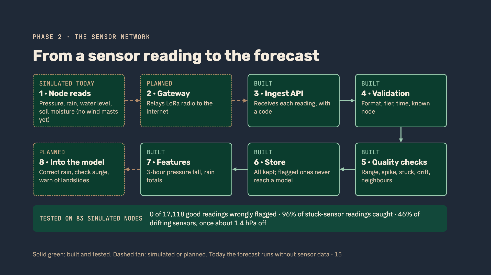

```bash
.venv/bin/python -m telemetry.simulate MONTHA 2025 --region andhra
```

83 virtual nodes (39 air, 36 rain, 4 water, 4 slope), placed by the tier
rules, observe Montha's best track with faults injected on purpose. The first
run exposed the quality control as it stood, and fixing it gave:

| QC version | Clean readings wrongly flagged | Drifting readings caught | Stuck readings caught |
|---|---|---|---|
| Original, 82 nodes | 190 (1.12%) | 7 / 162 | 161 / 185 |
| Fixed, same 82 nodes | 6 (0.04%) | 75 / 162 | 177 / 185 |
| Committed, 83 nodes, line-aware neighbour check | **0 of 17,118 (0.00%)** | **74 / 161 (46%)** | **181 / 189 (96%)** |

Drift is caught once a barometer is about 1.4 hPa off; earlier readings are
too close to the truth to flag. This tests the plumbing and the checks, not
the model.

---

## 11. Research behind the design

Before writing code, the team assembled a research dossier of about 8,000
words: the storm climatology of the North Indian Ocean, why the Bay of Bengal
turns storms into surge, how cyclone damage happens to each kind of asset, a
modelling toolkit from forecast to impact, an inventory of Earth Engine
datasets, IMD's warning stages, anticipatory action and parametric insurance,
and a survey of similar projects. The dossier itself is not in the
repository; its findings, and the sources behind the figures used here, are
below.

### Six findings that shaped the build

1. **Lives are mostly protected now; infrastructure is not.** Hence
   asset-level impact, not district colours.
2. **Storm strength and damage do not track each other.** Senyar and Ditwah,
   the costliest storms of 2025, were weak, rain-driven storms. Hence rain as
   a first-class damage pathway.
3. **The northern Bay turns storms into surge,** through a broad shallow
   shelf, a concave coast and tides up to about 6 m near Sandwip, and each
   stretch of coast behaves differently. Hence a terrain-based surge screen,
   honestly labelled as a screen, with coupled models (ADCIRC, SCHISM, IIT
   Delhi's 3.7 km model) as the named next step.
4. **Rapid intensification is what goes wrong.** Amphan went from 140 to
   215 km/h in six hours, and the Red Cross typhoon trigger in the
   Philippines failed to fire for Typhoon Rai. Hence ensembles, a rerun every
   forecast cycle, and uncertainty shown everywhere.
5. **India's warning pipe exists; what goes into it is thin.** SACHET is
   built on CAP and has sent over 134 billion alerts in 19+ languages, and
   IMD has issued district-level impact-based warnings since 2020. Hence
   CAP output for SACHET, not a new delivery system.
6. **Google already ships strong building blocks.** WeatherNext, the Weather
   Lab archive (CC BY 4.0), Earth Engine and Gemini. Hence building the
   Bay of Bengal layer on top of them, not rebuilding them.

### Similar projects, and where each stops

| Project | What it does | Where it stops |
|---|---|---|
| IMD impact-based warnings, Web-DCRA | District-level warnings from forecasts plus geospatial and population data | District level, not asset level |
| INCOIS surge and vulnerability | Real-time surge and inundation forecasts; coastal vulnerability atlas | Hazard only; no link to infrastructure or department advisories |
| SACHET (NDMA, C-DOT) | National CAP alert delivery by SMS and cell broadcast | Delivers alerts, does not model impact |
| SATARK (Odisha), TN-SMART (Tamil Nadu) | State multi-hazard alerting and impact assessment | Single state; public alerts |
| AWARE 2.0 (Andhra Pradesh) | Data lake, drones and CCTV; 9.5 million alerts for Montha | Proprietary; published details focus on monitoring, not asset fragility |
| Weather Lab / WeatherNext (Google DeepMind) | AI ensemble forecasts of track, intensity and wind structure | The forecast layer only; no infrastructure impact or dispatch |
| Google Flood Hub | AI river-flood forecasts across India | River floods only; not surge or cyclone-specific |
| GDACS (EC JRC, UN OCHA) | Global cyclone alerts and surge levels | Country level; alert score is wind-only |
| 510 typhoon model (Netherlands Red Cross) | Predicts % of houses damaged per municipality 72 h ahead | Housing only; Philippines; missed Rai |
| CLIMADA (ETH Zürich) | Open probabilistic hazard × exposure × vulnerability engine | A library, not an operations tool; its wind curve is used here |

**The gap this project fills:** asset-level impact with a failure
probability for each named asset; a rainfall pathway for weak storms;
department-specific, multilingual CAP advisories drafted by Gemini and
approved by a person; a parametric trigger monitor with a basis-risk view;
and an open backtest of AI track forecasts against IMD's best track.

### Selected sources

- **Storm history and losses:**
  - [1999 Odisha cyclone](https://en.wikipedia.org/wiki/1999_Odisha_cyclone)
  - [World Economic Forum: lessons from Fani](https://www.weforum.org/stories/2019/12/disaster-relief-lessons-cyclone-fani-odisha/)
  - [NASA Earth Observatory: lights out after Fani](https://science.nasa.gov/earth/earth-observatory/lights-out-after-cyclone-fani-145017/)
  - [2025 North Indian Ocean cyclone season](https://en.wikipedia.org/wiki/2025_North_Indian_Ocean_cyclone_season)
  - [Cyclone Senyar](https://en.wikipedia.org/wiki/Cyclone_Senyar)
  - [World Bank: Ditwah damage estimated at US$4.1 bn](https://www.worldbank.org/en/news/press-release/2025/12/22/damage-from-cyclone-ditwah-in-sri-lanka-estimated-at-4-1-billion)
  - [Deccan Herald: Montha damage revised to ₹6,384 crore](https://www.deccanherald.com/india/andhra-pradesh/andhra-pradesh-revises-cyclone-montha-damage-to-rs-6384-cr-seeks-urgent-aid-of-rs-900-cr-3792990)
  - [Vassar Labs: AWARE and Cyclone Montha](https://vassarlabs.com/from-early-alerts-to-action-how-aware-system-powered-andhra-pradeshs-response-to-cyclone-montha/)
- **Surge and the Bay's geography:**
  - [Blakely, Pringle & Kotamarthi (2026), storm-tide risk to critical infrastructure in the Bay of Bengal](https://www.nature.com/articles/s44304-026-00175-x)
  - [Adithyan et al. (2026), probabilistic surge hazard along the Bay of Bengal coast](https://link.springer.com/article/10.1007/s11069-026-08196-5)
- **Intensification:**
  - [Li et al. (2025), rapid intensification in the Arabian Sea](https://www.nature.com/articles/s43247-025-02477-w)
  - [Sagar et al. (2026), rapid strengthening over the North Indian Ocean](https://link.springer.com/article/10.1007/s10236-026-01801-y)
- **Impact modelling:**
  - [Eberenz et al. (2021), regional tropical cyclone impact functions](https://nhess.copernicus.org/articles/21/393/2021/)
  - [CLIMADA impact functions](https://climada-python.readthedocs.io/en/stable/user-guide/climada_entity_ImpactFuncSet.html)
  - [OCHA: peer review of the 510 typhoon model](https://centre.humdata.org/peer-review-of-510s-typhoon-model-and-its-use-in-the-philippines/)
- **Satellite checks:**
  - [UN-SPIDER: Sentinel-1 flood mapping in Earth Engine](https://un-spider.org/advisory-support/recommended-practices/recommended-practice-google-earth-engine-flood-mapping)
  - [VIIRS Black Marble (VNP46A2)](https://developers.google.com/earth-engine/datasets/catalog/NASA_VIIRS_002_VNP46A2)
- **Forecasts:**
  - [DeepMind: WeatherNext and cyclones](https://deepmind.google/blog/weathernext-ai-model-achieves-breakthrough-in-forecasting-cyclones/)
  - [Weather Lab developer guide](https://developers.google.com/weathernext/guides/weatherlab)
  - [WeatherNext on Earth Engine](https://developers.google.com/weathernext/guides/earth-engine)
  - [imdtrack](https://github.com/syedhamidali/imdtrack)
- **Warnings and alerting:**
  - [IMD's four-stage warning](https://rsmcnewdelhi.imd.gov.in/four-stage-warning.php)
  - [WMO Bulletin: CAP and cell broadcast](https://wmo.int/resources/wmo-bulletin/wmo-bulletin-vol-74-2-2025/leveraging-common-alerting-protocol-and-cell-broadcast-technology-advancing-early-warnings-all)
- **Risk finance:**
  - [Down To Earth: CDRI's Odisha infrastructure report](https://www.downtoearth.org.in/climate-change/india-plans-contract-overhaul-to-embed-disaster-resilience-as-report-flags-rs-181-lakh-crore-infrastructure-exposure)
  - [World Bank: disaster risk insurance in the Philippines](https://blogs.worldbank.org/en/climatechange/disaster-risk-insurance-5-insights-philippines)
- **Gemini:** [Gemini 3.7 Flash in the Gemini API](https://ai.google.dev/gemini-api/docs/models/gemini-3.7-flash)

Where the code relies on a figure, such as a fragility calibration count or
IMD's published track error, the figure and its source are also stated in
the code where it is used.

---

## 12. Guardrails

These are deliberate and should survive any refactor.

- **Gemini rewords and translates; it never originates a number.**
  `advisory/numbers.py` checks every field. Text is rejected if it has:
  - a number the code did not compute, in digits of any script, however it
    is grouped ("10,000", "1,00,000", "10 000");
  - a computed number in any unit other than the one the code used, however
    spelled ("54 kilometres/hour", "54 m/sec"), or in a unit no fact is
    ever given in (kW, tonnes, litres, hectares, rupees);
  - a number the code computed with a unit, reused without one (150 mm of
    rain reused as "150 households");
  - a number scaled by a magnitude ("50k", "10 lacs", "2 crore", "3x"), a
    signed number ("−48 h"), or a labelled one ("category 3");
  - any other numeral (½, ⑤, Ⅲ), or money;
  - a number spelled out in English, Telugu or Odia words;
  - a number borrowed from another department's advisory.

  A rejected field keeps the template text, with a note the officer can see.
  What the guardrail cannot catch, such as a false sentence with no number in
  it, is left to the officer approving the advisory, who is the last check.
- **The surge output is a screen, not a simulation,** and every label says
  so. Coupled models (ADCIRC, SCHISM, IIT Delhi 3.7 km) are the named next
  step.
- **Every demo alert carries `<status>Exercise</status>`** and passes an
  explicit human approval before dispatch. Approvals are tied to the forecast
  cycle and the exact text.
- **A deployment cannot be left writable by mistake.** Without its access
  codes, the container image refuses every write.
- **Telemetry is type-checked before it is stored.** Out-of-range readings
  are kept and flagged; values that cannot be readings are refused.
- **The low-voltage grid is not modelled,** and the console says so: OSM
  does not map poles or transformers.

---

## 13. Testing and quality

```bash
./check.sh                                                      # everything CI runs
BOB_NETWORK_TESTS=1 .venv/bin/python -m pytest -m network       # probes of live services
```

`check.sh` runs, in order:
1. lint (Ruff, ESLint);
2. strict type checks of the Python and the console's JavaScript;
3. 681 automated tests (614 Python, 67 JavaScript) with coverage floors;
4. the security checks:
   - Bandit rules;
   - a secret scan of files and history;
   - hashes and OSV advisories for the vendored JavaScript libraries;
   - `pip-audit`.

The same steps run in GitHub Actions (`.github/workflows/ci.yml`), which
also builds the container and smoke-tests it.

The suite is **hermetic**: Earth Engine is off, any Gemini key is cleared,
and tests that need real data use small committed extracts in
`tests/fixtures` (Weather Lab, GFS and Copernicus DEM). It includes:
- the console's JavaScript, run under Node;
- one real-browser test that approves and dispatches an advisory through
  headless Chrome, including the Telugu text.

On a laptop without Node or Chrome those two are skipped; in CI they are
required.

Dependencies are declared in `requirements.txt` (runtime),
`requirements-dev.txt` (checks) and `requirements-serve.txt` (the deployed
image), and locked with hashes in the matching `.lock` files. To regenerate
a lock after changing a declaration:

```bash
uv pip compile requirements-dev.txt --universal --python-version 3.12 --generate-hashes -o requirements-dev.lock
uv pip compile requirements-serve.txt --universal --python-version 3.12 --generate-hashes -o requirements-serve.lock
```

---

## 14. Configuration reference

All optional. Put them in `.env` (see [`.env.example`](.env.example)), or set
them in the shell, which wins over the file.

| Variable | Used by | Effect |
|---|---|---|
| `GEMINI_API_KEY` | pipeline, agent | Turns on Gemini drafting and translation |
| `GEMINI_API_KEY_2` | pipeline, agent | A second key, used only when the first runs out of quota. Helps only if it belongs to another Cloud project, since the free tier's quota is per project |
| `EE_PROJECT` | pipeline | Your Earth Engine Cloud project; required for Earth Engine, no default |
| `EARTHENGINE_OFF` | pipeline | `1` keeps a run offline even when signed in |
| `BOB_FIREBASE_PROJECT`, `BOB_FIREBASE_API_KEY`, `BOB_FIREBASE_APP_ID`, `BOB_OPERATORS` | API | Officers sign in with Google; only addresses (or `@domains`) on `BOB_OPERATORS` may act. Replaces the operator code when set |
| `BOB_OPERATOR_TOKEN` | API | Access code for approve, withdraw, dispatch and the audit log; at least 16 ASCII characters |
| `BOB_INGEST_TOKEN` | API | Access code for telemetry writes; the same minimum |
| `BOB_REQUIRE_TOKENS` | API | `1` refuses writes when a code is missing, as on Cloud Run; the image sets it |
| `BOB_AUDIT_STORE`, `BOB_BQ_AUDIT_TABLE` | API | `bigquery` and `project.dataset.table` keep approvals in BigQuery. Default: SQLite |
| `BOB_AUDIT_DB`, `BOB_TELEMETRY_DB` | API | Where approvals and telemetry are stored, as SQLite files |
| `BOB_NODE_REGISTRY` | API | A file listing the node ids allowed to post telemetry |
| `BOB_ALLOWED_HOSTS` | API | Host names the server answers to. Default: `localhost`, `127.0.0.1`, `[::1]`, plus `*.run.app` on Cloud Run |
| `BOB_API_DOCS` | API | `1` turns on `/docs` on Cloud Run, where it is off by default |
| `BOB_OPERATOR_WRITES_PER_MIN`, `BOB_TELEMETRY_WRITES_PER_MIN` | API | Write budgets (default 30 and 1,200 a minute) |
| `BOB_FAILED_AUTH_PER_MIN` | API | Wrong-code attempts allowed per address (default 20) |
| `BOB_NETWORK_TESTS` | tests | `1` also runs the tests that probe live services |
| `PORT`, `STORM`, `LEAD` | `run.sh` | Port, and the replay to open first |

`/api/health` reports which modes are in effect and anything misconfigured.

---

## 15. Security and secrets

- **No keys, tokens or project ids are in this repository.** They live only
  in a local `.env`, which git, Docker (`.dockerignore`) and Cloud Build
  (`.gcloudignore`) all ignore, as they do every `.env.*` variant except the
  placeholder `.env.example`.
- **Every user brings their own Google Cloud project.** The code has no
  default Earth Engine or Firebase project, so nothing runs against, or
  bills, anyone else's.
- **`check.sh` scans the files and the git history for secrets** on every
  change, and CI refuses a shallow clone, which would hide history from it.
- **On Cloud Run, the access codes live in Secret Manager**, never in the
  service's configuration. The image holds no credentials.
- **The Firebase web configuration is public by design:** Google sends it
  to every browser that loads the sign-in. It is not a secret, but it is
  still kept out of the repository and read from the environment.
- The console runs under a strict content security policy with no inline
  script. MapLibre and Firebase are served from the image and checked
  against pinned hashes, and requests are checked for host, origin, size and
  depth.

To report a security problem, open a private
[security advisory](https://github.com/yashm-0804/project-cyclops/security/advisories/new)
rather than a public issue.

---

## 16. What is not built yet

Named here so the rest of this page stays honest.

| Planned | State |
|---|---|
| Live IMD bulletin reading | Not built. Replays work; `agent.watch --live` refuses with a reason. Reading bulletin PDFs is Gemini's intended job |
| River flooding (height above drainage) | Not built; the fix for the flood screen's miss |
| Low-voltage grid (poles, transformers) | Not built. OSM does not map them |
| Population weighting (GHSL) | Not started; headcounts are scaled estimates |
| Physical sensor nodes and radio transport | Phase 2. The schema, ingest, checks and features are built and tested on simulated nodes |
| Sensor data feeding the model | Planned; today the forecast runs without sensor data |
| Parametric triggers | Built, with illustrative zones and thresholds, not real policies |
| Cloud Run deployment | Packaged and tested locally; not deployed (needs a billing account) |
| Per-gateway telemetry keys | Not built. One shared ingest code; `BOB_NODE_REGISTRY` limits which nodes may report |

---

## 17. Roadmap

All proposed; none funded yet.

- **Weeks 1–2, platform:**
  - deploy on Cloud Run;
  - spoken alerts in Telugu and Odia (Cloud Text-to-Speech);
  - Cloud Translation as a fallback when Gemini is unavailable.
- **Before the next cyclone season, model:**
  - route rain through rivers;
  - add poles and lines for area-wide outages;
  - have Gemini read live IMD bulletins;
  - score every change on storms it was not tuned on.
- **One cyclone season, network pilot:**
  - air and rain nodes in one coastal district, with its power utility and
    District Collector;
  - readings into BigQuery through Pub/Sub.

  Success means sensor-corrected rain beating the global forecast's rain on
  a storm the model was not tuned on.

**What we need:** a billing account to deploy on Cloud Run, and one coastal
district with its power utility to pilot with.

---

## 18. Repository layout

```
project-cyclops/
├── ingest/        storm tracks, WeatherNext ensembles, GFS rain, Earth Engine sign-in
├── hazard/        wind (Holland), surge screen, rainfall, terrain
├── exposure/      OpenStreetMap assets
├── impact/        fragility curves, criticality, per-asset scoring, parametric triggers
├── advisory/      CAP 1.2, Gemini drafting, the number guardrail
├── verify/        track, rain, flood and outage skill against observations
├── telemetry/     sensor tiers, ingest, quality control, simulated network
├── agent/         reruns each forecast cycle and reports what changed
├── api/           FastAPI server: approvals, sign-in, audit trail, security
├── web/           the operator console (MapLibre and Firebase served locally)
├── data/runs/     the eight committed forecast replays
├── scripts/       BigQuery setup, benchmark, screenshots, smoke test
├── tests/         Python and JavaScript tests, fixtures, browser test
├── docs/          architecture, model skill, benchmark, demo script, screenshots
├── pipeline.py    one forecast cycle, end to end
├── run.sh         start the console
├── check.sh       every check CI runs
├── Dockerfile     the Cloud Run image
└── DEPLOY.md      deploying, sign-in and BigQuery in detail
```

---

## 19. Data sources and attribution

| Data | Source | Licence or terms |
|---|---|---|
| Cyclone best tracks | IMD RSMC New Delhi, via [`imdtrack`](https://github.com/syedhamidali/imdtrack) | IMD data; `imdtrack` BSD-3 |
| Cyclone ensemble forecasts | Google DeepMind [Weather Lab](https://developers.google.com/weathernext/guides/weatherlab) (WeatherNext 3) | CC BY 4.0 |
| Rainfall forecast | NOAA GFS 0.25°, via the NOAA Open Data Dissemination program on AWS | Public domain |
| Elevation | Copernicus GLO-30 DEM, via Earth Engine or AWS | © DLR e.V. 2010–2014 and © Airbus Defence and Space GmbH 2014–2018, provided under COPERNICUS by the European Union and ESA |
| Infrastructure | © [OpenStreetMap](https://www.openstreetmap.org/copyright) contributors | ODbL |
| Observed rain | NASA GPM IMERG V07, via Earth Engine | NASA open data |
| Observed flooding | Copernicus Sentinel-1, via Earth Engine | Copernicus open data |
| Night lights | NASA VIIRS Black Marble VNP46A2, via Earth Engine | NASA open data |
| Basemap tiles | © CARTO, © OpenStreetMap contributors | CARTO terms |
| Map library | [MapLibre GL JS](https://maplibre.org/) | BSD-3 |
| Sign-in library | Firebase JS SDK | Apache-2.0 |

## Licence

The code is released under the [MIT License](LICENSE). The libraries served
from `web/vendor` keep their own licences: MapLibre GL JS under BSD-3-Clause
([`web/vendor/maplibre-gl/LICENSE.txt`](web/vendor/maplibre-gl/LICENSE.txt))
and the Firebase JS SDK under Apache-2.0. The data keeps the terms in the
table above.

Built by **Team SPECODERS** for Build with AI: Code for Communities
(2nd edition), Track 5.
